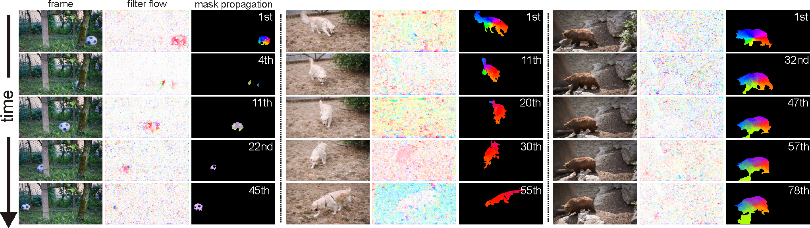
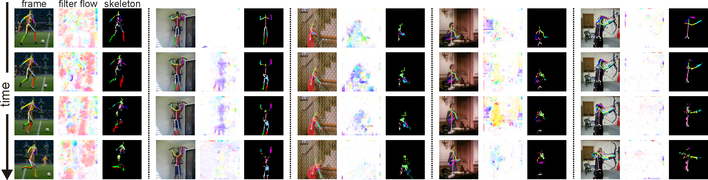
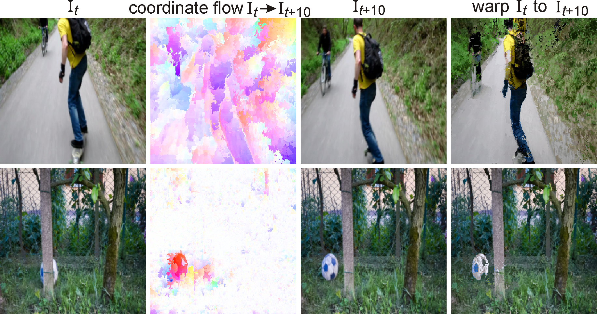
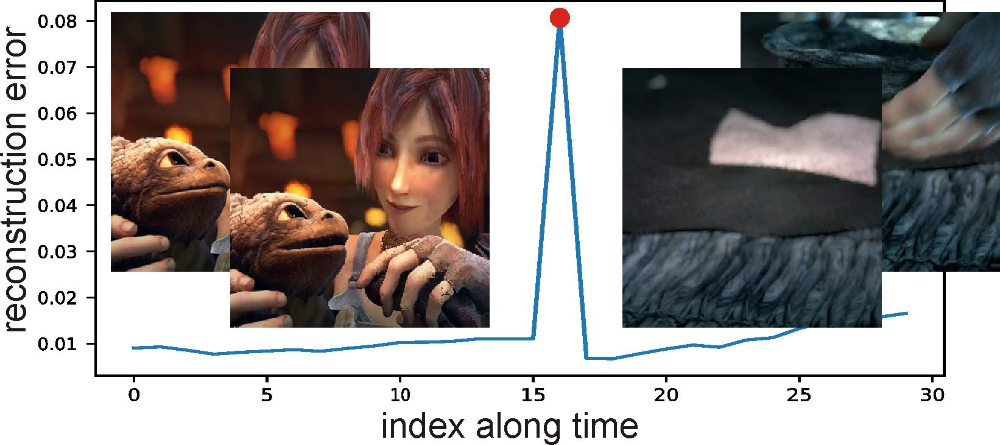
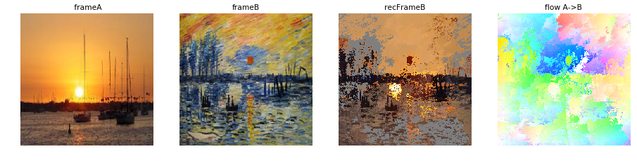
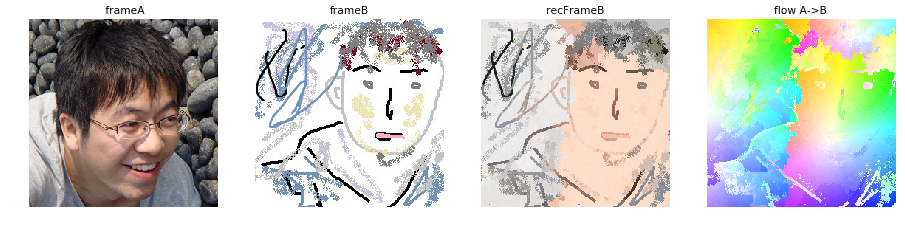
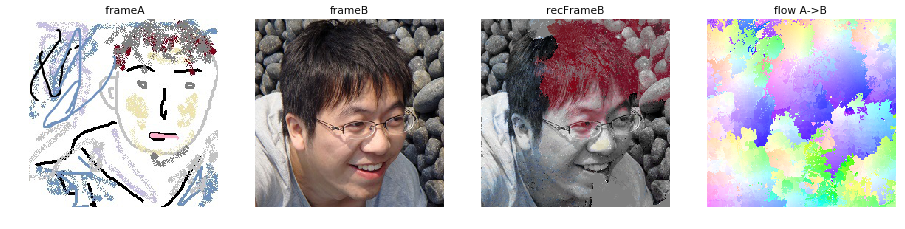
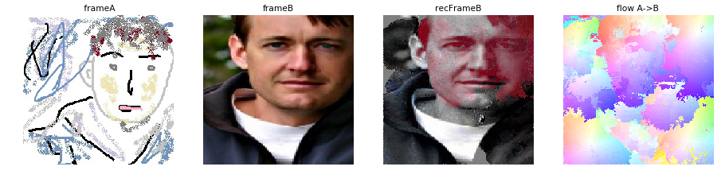

## Multigrid Predictive Filter Flow for Unsupervised Learning on Videos

For paper, slides and poster, please refer to our [project page](https://www.ics.uci.edu/~skong2/mgpff.html "multigrid predictive filter flow")

dog             |  soccerball
:-------------------------:|:-------------------------:
  |  

We introduce multigrid Predictive Filter Flow (mgPFF), 
a framework for unsupervised learning on videos.
The mgPFF takes as input a pair of frames and outputs per-pixel filters to warp one frame to the other. 
Compared to optical flow used for warping frames, 
mgPFF is more powerful in modeling sub-pixel movement and dealing with corruption (e.g., motion blur). 
We develop a multigrid coarse-to-fine modeling strategy that avoids the requirement of learning large filters to capture large displacement. 
This allows us to train an extremely compact model (**4.6MB**) which operates in a progressive way over multiple resolutions with shared weights. 
We train mgPFF on unsupervised, 
free-form videos and show that mgPFF is able to not only estimate long-range flow for frame reconstruction and detect video shot transitions, 
but also readily amendable for video object segmentation and pose tracking, 
where it substantially outperforms the published state-of-the-art without bells and whistles. 
Moreover, owing to mgPFF's nature of per-pixel filter prediction, 
we have the unique opportunity to visualize how each pixel is evolving during solving these tasks, 
thus gaining better interpretability.

**keywords**: Unsupervised Learning, Multigrid Computing, Long-Range Flow, Video Segmentation, Instance Tracking, Pose Tracking, Video Shot/Transition Detection, Optical Flow, Filter Flow, Low-level Vision.

If you find anything provided here inspires you, please cite our [arxiv paper](http://arxiv.org/abs/1904.01693)

    @article{kong2019mgPFF,
      title={Multigrid Predictive Filter Flow for Unsupervised Learning on Videos},
      author={Kong, Shu and Fowlkes, Charless},
      journal={arXiv preprint arXiv:1904.01693},
      year={2019}
    }

----
## Video Object Segmentation/Tracking

gating the mask using the predicted filter flow. Through visualization, we have a unique opportunity to track each pixel and understand how every single pixel evolves over time. 

----
## Human Pose Tracking

Propagating the keypoints with the predicted filter flow. Through visualization, we have the unique opportunity to track each pixel along the skeleton and understand how every single pixel evolves over time. 

----
## Long-Range Flow for Frame Reconstruction

Long-Range Flow for Frame Reconstruction

----
## Video Transition Shot Detection

Purely based on the reconstruction by mgPFF, we are able to detection video transition shot. This makes training our mgPFF possible on free-form videos, e.g., long movies. 

----
## Style Transfer 

The power of mgPFF in long-range flow learning enables a native style transfer. 
Just grab the sunset in Newport Beach and Monet's painting, 
and translate between each other (A->B). 
They are not great, but it seems to work (Improved results on the way:-)

----
## Sketch to Photo

This simple sketch-photo translation demonstrates the power of mgPFF in correspondence learning. 
Note how the details are synthesized from the given image/sketch. 

----

last update: 04/01/2019

Shu Kong

issues/questions addressed here: 
aimerykong At g-m-a-i-l dot com
